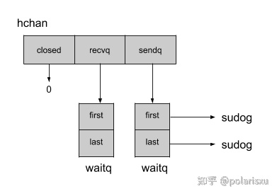
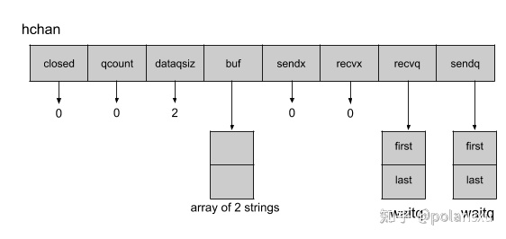
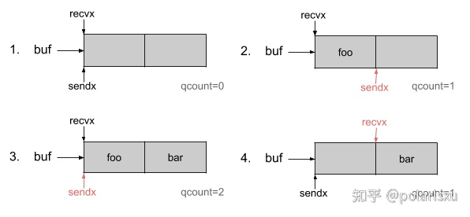
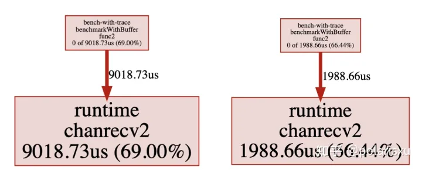
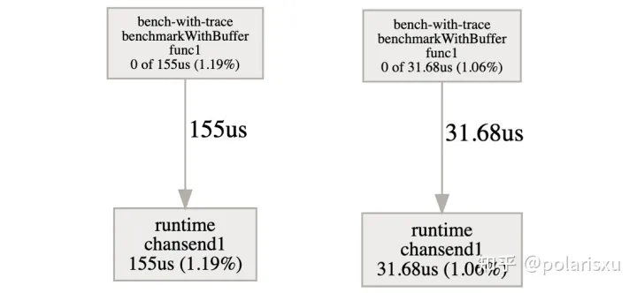

# 通道

Go 中的通道（channel）机制十分强大，但是理解内在的概念甚至可以使它更强大。实际上，选择缓冲通道或无缓冲通道将改变应用程序的行为和性能。

## 无缓冲通道

无缓冲通道是在消息发送到通道时需要接收器的通道。声明一个无缓冲通道时，你不需要声明容量。

```go
package main

import (
    "sync"
    "time"
)

func main() {
    c := make(chan string)

    var wg sync.WaitGroup
    wg.Add(2)

    go func() {
        defer wg.Done()
        c <- `foo`
    }()

    go func() {
        defer wg.Done()

        time.Sleep(time.Second * 1)
        println(`Message: `+ <-c)
    }()

    wg.Wait()
}
```


由于没有准备就绪的接收者，第一个`goroutine`在发送消息`foo`时将被阻塞。这个**说明文档**很好地解释了这种行为:

https://go.dev/ref/spec#Channel_types

>  如果容量为零或未设置，则通道将被无缓冲，只有在发送方和接收方都准备就绪时通信才能成功。
>  

这一点，**《Effective Go》**中描述的也很清晰：

https://go.dev/doc/effective_go#channels

>  如果通道是无缓冲的，发送者将被阻塞，直到接收者接收到值。
>  

通道的内部描绘可以给我们更多关于此行为的有趣的细节

**无缓冲通道内部结构**

`channel` 结构体 在 `runtime` 包的 `chan.go` 文件中可以找到。该结构包含与通道缓冲区相关的属性，但是为了说明无缓存的通道，我将省略我们稍后将看到的那些属性。下面是无缓冲通道的示意图：



通道维护了指向接收方（ `recvq` ）和发送方（ `sendq` ）列表的指针，由链表 `waitq.sudog`表示 ，包含指向下一个元素的指针（next）和指向上一个元素的指针（previous），以及与处理 *接收方/发送方* 的 goroutine 相关的信息。有了这些信息，Go 程序就很容易知道，如果没有了发送方，通道就应该阻塞接收方，反之，没有了接收方，通道就应该阻塞发送方。

下面是我们前面示例的工作流:

1. 通道是用一个空的接收方和发送方列表创建的。
2. 第 16 行，我们的第一个 goroutine 将值 `foo` 发送到通道。
3. 通道从（缓冲）池中获取一个结构体 `sudog`，用以表示发送者。这个结构将维护对 goroutine 和值 `foo` 的引用。
4. 这个发送者现在进入队列（enqueued ） `sendq` 。
5. 由于“*chan send*”阻塞，goroutine 进入等待状态。
6. 第 23 行，我们的第二个 goroutine 将读取来自通道的消息。
7. 通道将弹出 `sendq` 队列，以获取步骤 3 中的等待发送的结构体。
8. 通道将使用 `memmove` 函数将发送方发送的值(封装装在 `sudog` 结构中)复制到读取的通道的变量。
9. 现在，我们的第一个 goroutine 可以恢复在第 5 步，并将释放在第 3 步获得的 `sudog`。

正如我们在工作流中再次看到的，goroutine 必须切换到等待，直到接收器可用为止。但是，如果需要，这种阻塞行为可以通过缓冲通道避免。

**缓冲通道内部结构**

稍微改动之前的例子，以添加一个缓冲区：

```go
package main

import (
    "sync"
    "time"
)

func main() {
    c := make(chan string, 2)

    var wg sync.WaitGroup
    wg.Add(2)

    go func() {
        defer wg.Done()

        c <- `foo`
        c <- `bar`
    }()

    go func() {
        defer wg.Done()

        time.Sleep(time.Second * 1)
        println(`Message: `+ <-c)
        println(`Message: `+ <-c)
    }()

    wg.Wait()
}
```


现在让我们根据这个例子分析结构`hchan`和与缓冲区相关的字段:



buffer（缓冲）由以下五个属性组成：

- `qcount` 存储缓冲区中元素的当前数量
- `dataqsiz` 存储缓冲区中最大元素的数量
- `buf` 指向一个内存段，该内存段包含缓冲区中元素的最大数量的空间
- `sendx` 存储缓冲区中的位置，以便通道接收下一个元素
- `recvx` 在缓冲区中存储通道返回的下一个元素的位置

通过`sendx`和`recvx`，这个缓冲区就像一个循环队列:



这个循环队列允许我们在缓冲区中维护一个顺序，而不需要在其中一个元素从缓冲区弹出时不断移动元素。

正如我们在前一节中看到的那样，一旦达到缓冲区的上限，尝试在缓冲区中发送元素的 goroutine 将被移动到发送者列表中，并切换到等待状态。 然后，一旦程序读取缓冲区，从缓冲区中返回位于 `recvx` 位置的元素，将释放等待的 goroutine ，它的值将被推入缓冲中。 这种属性使 通道有[FIFO(先进先出)]([http://lsm6ds3](https://link.zhihu.com/?target=http%3A//lsm6ds3) fifo pattern/)的行为。

## **由于缓冲区大小不足造成的延迟**

我们在通道创建期间定义的缓冲区大小可能会极大地影响性能。我使用扇出模式来密集使用通道，以查看不同缓冲区大小的影响。以下是一些压力测试:

```go
package bench

import (
    "sync"
    "sync/atomic"
    "testing"
)

func BenchmarkWithNoBuffer(b *testing.B) {
    benchmarkWithBuffer(b, 0)
}

func BenchmarkWithBufferSizeOf1(b *testing.B) {
    benchmarkWithBuffer(b, 1)
}

func BenchmarkWithBufferSizeEqualsToNumberOfWorker(b *testing.B) {
    benchmarkWithBuffer(b, 5)
}

func BenchmarkWithBufferSizeExceedsNumberOfWorker(b *testing.B) {
    benchmarkWithBuffer(b, 25)
}

func benchmarkWithBuffer(b *testing.B, size int) {
    for i := 0; i < b.N; i++ {
        c := make(chan uint32, size)

        var wg sync.WaitGroup
        wg.Add(1)

        go func() {
            defer wg.Done()

            for i := uint32(0); i < 1000; i++ {
                c <- i%2
            }
            close(c)
        }()

        var total uint32
        for w := 0; w < 5; w++ {
            wg.Add(1)
            go func() {
                defer wg.Done()

                for {
                    v, ok := <-c
                    if !ok {
                        break
                    }
                    atomic.AddUint32(&total, v)
                }
            }()
        }

        wg.Wait()
    }
}
```

>  译者注：上边代码和说明匹配，了解详情请参考原文
>  

在我们的基准测试中，一个生产者将在通道中注入一个 100 万个整数元素，而十个消费者将读取他们，并将它们累加到一个名为 `total` 的结果变量中。

我使用 `benchstat` 运行他们 10 次来分析结果：

```text
name                                    time/op
WithNoBuffer-8                          306µs ± 3%
WithBufferSizeOf1-8                     248µs ± 1%
WithBufferSizeEqualsToNumberOfWorker-8  183µs ± 4%
WithBufferSizeExceedsNumberOfWorker-8   134µs ± 2%
```

一个适当大小的缓冲区确实可以使您的应用程序更快！让我们跟踪分析基准测试，以确定延迟在哪里。

## **追踪延迟**

跟踪基准测试将使您访问同步阻塞概要文件，该概要文件显示等待同步原语的 goroutines 阻塞位于何处。 Goroutines 在同步过程中花费了 9ms 的时间来等待无缓冲通道的值，而 50 大小的缓冲区只等待 1.9ms:



由于缓冲的存在，来自发送值的等待延迟减小了 5 倍：



我们现在确实证实了我们以前的怀疑。缓冲区的大小对应用程序的性能有重要影响。