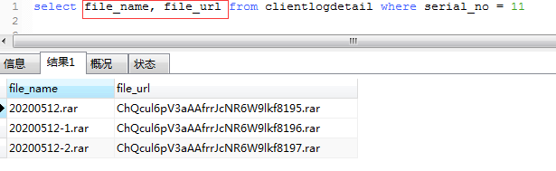
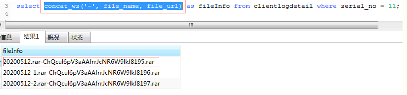
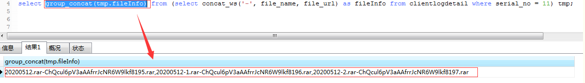
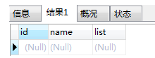
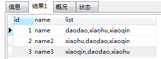
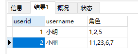
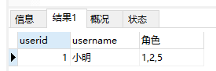

**PS:仅含免费的leetcode题目**

# 1.两数之和

```go
package main

import "fmt"

func main() {
	nums := []int{3, 2, 4}
	target := 6
	index := twoSum(nums, target)
	fmt.Println(index)
}
func twoSum(nums []int, target int) []int {
	var index []int
	var res []int
	hashSet := make(map[int]struct{})
	for k1 := 0; k1 < len(nums); k1++ {
		for k2 := 0; k2 < len(nums); k2++ {
			num1 := nums[k1]
			num2 := nums[k2]
			if num1+num2 == target && k1 != k2 {
				index = append(index, k1)
				index = append(index, k2)
			}
			for _, v := range index {
				hashSet[v] = struct{}{}
			}
		}
	}
	for k, _ := range hashSet {
		res = append(res, k)
	}
	return res
}

```

# 3.无重复字符的最长子串

```go
package main

import (
	"fmt"
)

func main() {
	s := "pwwkew"
	i := lengthOfLongestSubstring(s)
	fmt.Println(i)
}
func lengthOfLongestSubstring(s string) int {
	l, r, max := 0, 0, 0
	m := map[byte]int{}
	for ; r < len(s); r++ {
		v := s[r]
		if _, ok := m[v]; !ok {
			m[v] = r
		} else {
			//更新r，设置l=之前的r+1
			if m[v]+1 >= l {
				l = m[v] + 1
			}
			m[v] = r
		}
		if r-l+1 > max {
			max = r - l + 1
		}
		fmt.Println(m)
	}
	return max
}

/*
l, r, Max := 0, 0, 0
	m := map[byte]int{}
	for ; r < len(s); r++ {
		fmt.Println(m[s[r]])
		fmt.Println(string(s[r]))
		if _, ok := m[s[r]]; !ok {
			m[s[r]] = r
		} else {
			if m[s[r]]+1 >= l {
				l = m[s[r]] + 1
			}
			m[s[r]] = r
		}
		if r-l+1 > Max {
			Max = r - l + 1
		}
	}
	return Max
*/

```


# 5.最长回文子串(待完成)

```go
package main

import "fmt"

func main() {
	s := "babad"
	fmt.Println(longestPalindrome(s))
}
func longestPalindrome(s string) string {
	left, right, max, l, r := 0, 1, 0, 0, 0

	for i := 0; i < len(s); i++ {
		if s[left] == s[right] {
			if left-1 >= 0 {
				left--
				right++
			}
		} else {
			left++
			right++
		}
		if right-left+1 > max {
			max = right - left + 1
			l = left
			r = right + 1
		}
	}
	ss := s[l:r]
	return ss
}

```


# 26.删除有序数组中的重复项

```go
package main

import "fmt"

func main() {
	nums := []int{0, 0, 1, 1, 1, 2, 2, 3, 3, 4}
	l := removeDuplicates(nums)
	fmt.Println(l)
}
func removeDuplicates(nums []int) int {
	if len(nums) == 0 {
		return 0
	}
	left, right := 1, 1
	for right < len(nums) {
		if nums[right] != nums[right-1] {
			nums[left] = nums[right]
			left++
		}
		right++
	}
	return left
}

// 错误：题目要求不要使用额外的空间，必须在原地修改输入数组 并在使用O(1)额外空间的条件下完成
func removeDuplicates(nums []int) int {
	intInSlice := func(i int, list []int) bool {
		for _, v := range list {
			if v == i {
				return true
			}
		}
		return false
	}
	var Uniq []int
	for _, v := range nums {
		if !intInSlice(v, Uniq) {
			Uniq = append(Uniq, v)
		}
	}
	fmt.Println(Uniq)
	return len(Uniq)
}

// 错误：要在原数组基础上删除
func removeDuplicates(nums []int) int {
	hashSet := make(map[int]struct{})
	for _, v := range nums {
		hashSet[v] = struct{}{}
	}
	return len(hashSet)
}

方法一：双指针

这道题目的要求是：对给定的有序数组 nums\textit{nums}nums 删除重复元素，在删除重复元素之后，每个元素只出现一次，并返回新的长度，上述操作必须通过原地修改数组的方法，使用 O(1)O(1)O(1) 的空间复杂度完成。

由于给定的数组 nums\textit{nums}nums 是有序的，因此对于任意 i<ji<ji<j，如果 nums[i]=nums[j]\textit{nums}[i]=\textit{nums}[j]nums[i]=nums[j]，则对任意 i≤k≤ji \le k \le ji≤k≤j，必有 nums[i]=nums[k]=nums[j]\textit{nums}[i]=\textit{nums}[k]=\textit{nums}[j]nums[i]=nums[k]=nums[j]，即相等的元素在数组中的下标一定是连续的。利用数组有序的特点，可以通过双指针的方法删除重复元素。

如果数组 nums\textit{nums}nums 的长度为 000，则数组不包含任何元素，因此返回 000。

当数组 nums\textit{nums}nums 的长度大于 000 时，数组中至少包含一个元素，在删除重复元素之后也至少剩下一个元素，因此 nums[0]\textit{nums}[0]nums[0] 保持原状即可，从下标 111 开始删除重复元素。

定义两个指针 fast\textit{fast}fast 和 slow\textit{slow}slow 分别为快指针和慢指针，快指针表示遍历数组到达的下标位置，慢指针表示下一个不同元素要填入的下标位置，初始时两个指针都指向下标 111。

假设数组 nums\textit{nums}nums 的长度为 nnn。将快指针 fast\textit{fast}fast 依次遍历从 111 到 n−1n-1n−1 的每个位置，对于每个位置，如果 nums[fast]≠nums[fast−1]\textit{nums}[\textit{fast}] \ne \textit{nums}[\textit{fast}-1]nums[fast]​=nums[fast−1]，说明 nums[fast]\textit{nums}[\textit{fast}]nums[fast] 和之前的元素都不同，因此将 nums[fast]\textit{nums}[\textit{fast}]nums[fast] 的值复制到 nums[slow]\textit{nums}[\textit{slow}]nums[slow]，然后将 slow\textit{slow}slow 的值加 111，即指向下一个位置。

遍历结束之后，从 nums[0]\textit{nums}[0]nums[0] 到 nums[slow−1]\textit{nums}[\textit{slow}-1]nums[slow−1] 的每个元素都不相同且包含原数组中的每个不同的元素，因此新的长度即为 slow\textit{slow}slow，返回 slow\textit{slow}slow 即可。

链接：https://leetcode.cn/problems/remove-duplicates-from-sorted-array/solution/shan-chu-pai-xu-shu-zu-zhong-de-zhong-fu-tudo/

func removeDuplicates(nums []int) int {
    n := len(nums)
    if n == 0 {
        return 0
    }
    slow := 1
    for fast := 1; fast < n; fast++ {
        if nums[fast] != nums[fast-1] {
            nums[slow] = nums[fast]
            slow++
        }
    }
    return slow
}

复杂度分析
    时间复杂度：O(n)O(n)O(n)，其中 nnn 是数组的长度。快指针和慢指针最多各移动 nnn 次。
    空间复杂度：O(1)O(1)O(1)。只需要使用常数的额外空间。
```


# 175.组合两个表

```sql
select p.firstName as firstName, p.lastName as lastName,a.city as city, a.state as state from person p left join address a on p.personId = a.personId
-- 注意题目要求地址表中没有 personId = 1 的地址，所以它们的城市和州返回 null。addressId = 1 包含了 personId = 2 的地址信息。
```


# 176.第二高的薪水

```sql
select IFNULL((select distinct salary from Employee order by salary desc limit 1 offset 1),null) as SecondHighestSalary
```


```sql
补充：

1 聚合函数：max聚合，再过滤最大值

select ifnull(
    (select max(salary) 
    from Employee
    where salary < (select max(salary) from Employee)
    ),null
) as SecondHighestSalary;

2.1 排序法：先排序后分页查询

select(
    select distinct salary
    from Employee
    order by salary desc
    limit 1 offset 1
) as SecondHighestSalary; 

2.2 排序：用窗口函数进行排序

select (
    select salary 
    from(
        select distinct(salary), rank() over(order by salary desc) as ranking
        from Employee
    ) as rankTable
    where ranking = 2
) as SecondHighestSalary；

总结：
    ifnull 对查询速度的影响不大，加上可以提高可读性；
    加不加 as 来改名对速度影响不大，但建议加，以提升可读性；
    窗口函数适合的使用场景是“分组排序”，当然也可以不分组来直接解决排序查询任务，但影响了查询效率，代码量也大，不建议。优点是可以直接排序查询，并且很直观；但是缺点是查询速度会慢很多，可能是由于中间添加rank列并生成临时表的操作影响了查询速度。窗口函数的语法如下：

<窗口函数> over (partition by <用于分组的列名>  order by <用于排序的列名>)
```


# 177.第N高的薪水

```sql
CREATE FUNCTION getNthHighestSalary(N INT) RETURNS INT
BEGIN
SET N = N - 1;
  RETURN (
      # Write your MySQL query statement below. 
select IFNULL((select distinct salary from Employee order by salary desc limit 1 offset N),null) as SecondHighestSalary
  );
END
```


# 178.分数排名

```sql
方法1： dense_rank() over(order by 排序字段 desc/asc)：排序函数是相同数值相同序号，且序号是顺序的。 方法2： 排序序号是由大于等于当前分数的，且分数不同的人的个数组成的，所以要先按id（不同的人）分组，再计算不同分数的人的个数，作为排序的序号，展示结果按分数的降序进行。

select score, dense_rank() over(order by score desc) as 'rank' from scores 

性能问题（直接思维）
SELECT score, (SELECT count(DISTINCT score) FROM Scores WHERE score >= s.score) AS 'rank' FROM Scores s ORDER BY Score DESC ;


思路： 1.从两张相同的表scores分别命名为s1，s2。 2.s1中的score与s2中的score比较大小。意思是在输出s1.score的前提下，有多少个s2.score大于等于它。比如当s1.salary=3.65的时候，s2.salary中[4.00,4.00,3.85,3.65,3.65]有5个成绩大于等于他，但是利用count(distinct s2.score)去重可得s1.salary3.65的rank为3 3.group by s1.id 不然的话只会有一条数据 4.最后根据s1.score排序desc

select s1.score,count(distinct s2.score) as rank
from scores as s1,scores as s2
where s1.score<=s2.score
group by s1.id
order by s1.score desc;
```


# 179.最大数

```go
package main

import (
	"fmt"
	"strconv"
)

func main() {
	nums := []int{0, 0, 0}
    // nums := []int{999999998, 999999997, 999999999}
	l := largestNumber(nums)
	fmt.Println(l)
}
func largestNumber(nums []int) string {
	str := ""
	for i := 0; i < len(nums)-1; i++ {
		for j := 0; j < len(nums)-1-i; j++ {
			left := strconv.Itoa(nums[j])
			right := strconv.Itoa(nums[j+1])
			if left+right < right+left {
				nums[j], nums[j+1] = nums[j+1], nums[j]
			}
		}
	}
	for i := 0; i <= len(nums)-1; i++ {
		str += strconv.Itoa(nums[i])
	}
	if str[0] == '0' {
		return "0"
	}
	return str
}

// 补充，特殊情况，字符串由多个0字符拼接而成，且int64最大值为9223372036854775807，最小值为-9223372036854775808
```


# 180.连续出现的数字

```sql
select distinct num as ConsecutiveNums from(
    select num,lag(num) over (order by id) as lag_num,lead(num) over (order by id) as lead_num
    from logs
) as l where l.num=l.lag_num and l.num=l.lead_num
```


```sql
# 1. 三表直接连接
select distinct l1.num as ConsecutiveNums
from Logs as l1, Logs as l2, Logs as l3
where l1.id = l2.id - 1 and l1.id = l3.id - 2 and l1.num = l2.num and l2.num = l3.num

select distinct(l.Num) ConsecutiveNums 
from Logs l 
inner join Logs l2 on l.Num = l2.Num and  l.id = l2.id+1
inner join Logs l3 on l.Num = l3.Num and  l.id = l3.id+2

# 2. 利用having子句过滤

方法一：利用窗口函数求出diff后进行分组，再用having子句过滤
select distinct num as ConsecutiveNums
from (select num, id + 1 - row_number() over(partition by num order by id) as diff
      from Logs) t
group by num, diff
having count(*) >= 3

select distinct num as ConsecutiveNums from 
(select num,id-cast(dense_rank() over (partition by num order by id asc) as signed)  as rn from logs) t1
group by rn,num
having count(*)>=3

方法二：利用表自连接

根据num列相等对logs表进行自连接，根据l1.id进行聚合分组，若分组中满足l1.id与l2.id的差在0到2之间的l2.id大于2个，则说明该num连续出现3次

select distinct l1.num consecutivenums
from logs l1 join logs l2
on l1.num = l2.num
group by l1.id
having sum(l1.id - l2.id between 0 and 2) > 2

根据num列相等，以及id之差的范围在0到2之间，对logs表进行自连接，根据l1.id进行聚合分组，统计分组中l2.id的数目，若大于2即满足题意

select distinct l1.num consecutivenums
from logs l1 join logs l2
on l1.num = l2.num and l1.id - l2.id between 0 and 2
group by l1.id
having count(l2.id) > 2

根据num列相等，以及id之差的范围在0到2之间，对logs表进行自连接，根据l1.id进行聚合分组，统计分组中t1.Num的数目，若大于等于3即满足题意
SELECT distinct(t1.Num) ConsecutiveNums
FROM Logs t1, Logs t2
WHERE
    t1.Num = t2.Num 
    AND
    t2.id BETWEEN t1.id AND t1.id+2
GROUP BY t1.Id
HAVING count(t1.Num) >= 3;

# 3. 窗口函数
select distinct num as ConsecutiveNums
from (select num, (row_number() over(order by id) - row_number() over(partition by num order by id)) as diff
      from Logs) t
group by num, diff
having count(*) >= 3

select distinct num as ConsecutiveNums from
(
    select 
        num, 
        # 从当前记录获取前一行记录的num值，如果没有前一行，则返回null
        lag(num,1,null) over (order by id) as lag_num,
        # 从当前记录获取后一行记录的num值，如果没有后一行，则返回null
        lead(num,1,null) over (order by id) as lead_num
    from logs
) as l
# 当前值等于前一行的值，以及等于后一行的值，即满足了至少出现三次
where l.num = l.lag_num and l.num = l.lead_num

# 4. where子连接
SELECT DISTINCT Num AS ConsecutiveNums FROM Logs 
WHERE (Id+1, Num) IN (SELECT * FROM Logs)
AND (Id+2, Num) IN (SELECT * FROM Logs)

# 5. 利用用户变量实现对连续出现的值进行计数：

select distinct Num as ConsecutiveNums
from (
  select Num, 
    case 
      when @prev = Num then @count := @count + 1
      when (@prev := Num) is not null then @count := 1
    end as CNT
  from Logs, (select @prev := null,@count := null) as t
) as temp
where temp.CNT >= 3

与自关联或自连接相比，这种方法的效率更高，不受Logs表中的Id是否连续的限制，而且可以任意设定某个值连续出现的次数。

针对评论区朋友的疑问，这里做下解答：

1）逻辑：构建两个变量@prev 和@count ，前者用于与Num做比较判断，后者用于@prev和Num相等时的条件计数；

2）(select @prev := null,@count := null) as t 这句的作用是初始化两个变量，并将初始化后的变量放到一张临时表t中，:=符号在MySQL中是赋值的意思；

3）when @prev = Num then @count := @count + 1和when (@prev := Num) is not null then @count := 1 这两个语句不能交换顺序，赋值语句永远非NULL，所以一旦执行顺序来到了第二个when，@count 是一定会被赋值为1的，后者放到前面的话就达不到计数的目的；

4）(@prev := Num) is not null这部分去掉后面加的判断，SQL也能正常执行，上面SQL中case when的这种用法，when后是判断条件，赋值后又加判断，我原以为这样会好理解点；

5）case when本质是一个函数，有值时就返回内部处理得到的值，无值就返回NULL，针对每一个Num，上面SQL中的case when 都会有一个计数，并把这个计数返回给CNT。

PS：MySQL8.0以后的版本开始支持窗口函数，使用窗口函数也能很好的解决此类问题。关于MySQL的窗口函数，可以参考译文：https://blog.csdn.net/qq_41080850/article/details/86416106
```


# 181.超过经理收入的员工

```sql
select e.Name as Employee
from employee e
where salary > (select salary from employee where Id = e.ManagerId)
```


# 182.查找重读的电子邮箱

```sql
select distinct p1.email from person p1 inner join person p2 on p1.id!=p2.id and p1.email=p2.email

having ＋聚合函数 > select Email from Person group by Email having count(Email) > 1;
自链接 > select DISTINCT p1.Email from Person p1, Person p2 where p1.Email = p2.Email and p1.Id != p2.Id;
子表查询 > select Email from (select count(1) as t, Email from Person group by Email) r where r.t > 1;
```


# 183.从不订购的客户

```sql
# 左连接
select c.Name as Customers from Customers c left join Orders o on o.CustomerId = c.Id where o.Id is null;

# not exists
select c.Name as Customers from Customers c where not exists (select 1 from Orders o where o.CustomerId = c.Id);

# not in
select c.Name as Customers from Customers c where c.Id not in (select distinct o.CustomerId from Orders o);
```


# 184.部门工资最高的员工

```sql
# 1.开窗函数
select t.department ,t.employee,t.salary
from (
select d.name Department ,e.name employee,e.salary,dense_rank() over (partition by e.departmentId order by e.salary desc)  rn
from department d, employee e
where d.id=e.departmentId
) as t
where t.rn=1

# 2.max()最大值
select 
    d.Name as Department,
    e.Name as Employee,
    e.Salary 
from 
    Employee e,Department d 
where
    e.DepartmentId=d.id 
    and
    (e.Salary,e.DepartmentId) in (select max(Salary),DepartmentId from Employee group by DepartmentId);
```


# 185.部门工资前三高的所有员工

```sql
# 1.开窗函数
select t.department ,t.employee,t.salary
from (
select d.name Department ,e.name employee,e.salary,dense_rank() over (partition by e.departmentId order by e.salary desc)  rn
from department d, employee e
where d.id=e.departmentId ) as t
where t.rn<4

# 1.having count()
可以先group by然后用having count()来筛选，找每个部门的工资前三名，那么先在子查询中用Employee和自己做连接，连接条件是【部门相同但是工资比我高】，那么接下来按照having count(Salary) <= 2来筛选的原理是：如果【跟我一个部门而且工资比我高的人数】不超过2个，那么我一定是部门工资前三，这样内层查询可以查询出所有符合要求的员工ID，接下来外层查询就简单了。

select d.Name as Department,e.Name as Employee,e.Salary as Salary
from Employee as e left join Department as d 
on e.DepartmentId = d.Id
where e.Id in
(
    select e1.Id
    from Employee as e1 left join Employee as e2
    on e1.DepartmentId = e2.DepartmentId and e1.Salary < e2.Salary
    group by e1.Id
    having count(distinct e2.Salary) <= 2
)
and e.DepartmentId in (select Id from Department)
order by d.Id asc,e.Salary desc
```


# 187.重复的DNA序列(待完成)

```sql
package main

import "fmt"

func main() {
	// nums := []int{0, 0, 1, 1, 1, 2, 2, 3, 3, 4}
	nums := "AAAAAAAAAAAAA"

	l := findRepeatedDnaSequences(nums)
	fmt.Println(l)
}
func findRepeatedDnaSequences(s string) []string {
	arrStr := make([]string, 0)
	for i := 0; i+10 < len(s); i++ {
		str := s[i : i+10]
		for j := i; j+10 < len(s); j++ {
			if i != j {
				innerStr := s[j : j+10]
				if str == innerStr {
					arrStr = append(arrStr, str)
					break
				}
			}
		}
	}
	if len(arrStr) > 1 {
		if arrStr[0] == arrStr[1] {
			arrStr = append(arrStr[:1], arrStr[2:]...)
		}
	}
	return arrStr
}


错误：测试，"AAAAAAAAAAA"；输出，[]；预期结果，["AAAAAAAAAA"]
```


# 196.删除重复电子邮箱

```sql
delete from person where id not in (
    select t.id from (select min(id)as id from person group by email)t
    )

-- 错误：You can't specify target table 'person' for update in FROM clause
delete from person where id not in (
    select min(id)as id from person group by email
    )
-- 查询优化器对第一个查询执行派生合并优化（这会导致它因错误而失败），但第二个查询不符合派生合并优化的条件。因此，优化器被迫首先执行子查询。

https://stackoverflow.com/questions/45494/mysql-error-1093-cant-specify-target-table-for-update-in-from-clause
```


# 197.上升的温度

```sql
select w1.id from weather w1 inner join weather w2 on w1.temperature>w2.temperature and w1.recordDate=DATE_ADD(w2.recordDate,INTERVAL 1 DAY)

-- 方法一：我们可以使用MySQL的函数Datadiff来计算两个日期的差值，我们的限制条件是温度高且日期差1，参见代码如下：
select w1.Id from weather w1
inner join weather w2 on w1.Temperature > w2.Temperature and DATEDIFF(w1.RecordDate, w2.RecordDate) = 1;

-- 方法二：下面这种解法我们使用了MySQL的TO_DAYS函数，用来将日期换算成天数，其余跟上面相同：
SELECT w1.Id FROM Weather w1, Weather w2
WHERE w1.Temperature > w2.Temperature AND TO_DAYS(w1.RecordDate)=TO_DAYS(w2.RecordDate) + 1;

-- 方法三：我们也可以使用Subdate函数，来实现日期减1，参见代码如下：
SELECT w1.Id FROM Weather w1, Weather w2
WHERE w1.Temperature > w2.Temperature AND SUBDATE(w1.RecordDate, 1) = w2.RecordDate;
```


# 262.行程和用户

```sql
sql1
select t.request_at as Day,TRUNCATE(count((t.banned='No' and t.status!='completed') or null)/count(t.banned='No' or null),2) as "Cancellation Rate" from (select * from trips t left join users u on t.client_id=u.users_id) as  t group by t.request_at

sql2
select p.Day, CAST(p.a*1.0/p.b as decimal(8,2)) as "Cancellation Rate" from (select t.request_at as Day,count((t.banned='No' and t.status!='completed') or null) as a,count(t.banned='No' or null) as b from (select * from trips t left join users u on t.client_id=u.users_id) as  t group by t.request_at) as p

sql1和sql2存在错误，错误情形：
输入：{"headers": {"Trips": ["id", "client_id", "driver_id", "city_id", "status", "request_at"], "Users": ["users_id", "banned", "role"]}, "rows": {"Trips": [["1", "1", "10", "1", "cancelled_by_client", "2013-10-04"]], "Users": [["1", "No", "client"], ["10", "No", "driver"]]}}
输出：{"headers": ["Day", "Cancellation Rate"], "values": [["2013-10-04", 1.00]]}
期望：{"headers": ["Day", "Cancellation Rate"], "values": []}
问题：写一段 SQL 语句查出 "2013-10-01" 至 "2013-10-03" 期间非禁止用户（乘客和司机都必须未被禁止）的取消率。非禁止用户即 banned 为 No 的用户，禁止用户即 banned 为 Yes 的用户。题目要求时间范围！

sql3
SELECT
	p.request_at AS DAY,
	CAST(
	p.a * 1.0 / p.b AS DECIMAL ( 8, 2 )) AS "Cancellation Rate" 
FROM
	(
	SELECT
		t.request_at,
		count(( t.banned = 'No' AND t.STATUS != 'completed' ) OR NULL ) AS a,
		count( t.banned = 'No' OR NULL ) AS b 
	FROM
		( SELECT * FROM trips t LEFT JOIN users u ON t.client_id = u.users_id ) AS t 
	GROUP BY
		t.request_at 
	) AS p
WHERE
	p.request_at >= '2013-10-01' 
	AND p.request_at <= '2013-10-03' 

sql3存在错误，错误情形：
输入：{"headers": {"Trips": ["id", "client_id", "driver_id", "city_id", "status", "request_at"], "Users": ["users_id", "banned", "role"]}, "rows": {"Trips": [["1111", "1", "10", "1", "completed", "2013-10-01"]], "Users": [["1", "Yes", "client"], ["10", "No", "driver"]]}}
输出：{"headers": ["DAY", "Cancellation Rate"], "values": [["2013-10-01", null]]}
期望：{"headers":["Day","Cancellation Rate"],"values":[]}
问题：未考虑被除数为0的情况

sql4
SELECT
	p.request_at as DAY,
	CAST(p.a * 1.0 / p.b AS DECIMAL ( 8, 2 )) AS "Cancellation Rate" 
FROM
	(
	SELECT
		t.request_at,
		count(( t.banned = 'No' AND t.STATUS != 'completed' ) OR NULL ) AS a,
		count( t.banned = 'No' OR NULL ) AS b 
	FROM
		( SELECT * FROM trips t LEFT JOIN users u ON t.client_id = u.users_id ) AS t 
	GROUP BY
		t.request_at 
	) AS p
WHERE
	p.request_at >= '2013-10-01' 
	AND p.request_at <= '2013-10-03' 
    AND p.b != 0
    
sql4存在错误，错误情形：
输入：{"headers": {"Trips": ["id", "client_id", "driver_id", "city_id", "status", "request_at"], "Users": ["users_id", "banned", "role"]}, "rows": {"Trips": [["1111", "1", "10", "1", "completed", "2013-10-01"]], "Users": [["1", "Yes", "client"], ["10", "No", "driver"]]}}
输出：{"headers": ["DAY", "Cancellation Rate"], "values": [["2013-10-01", null]]}
期望：{"headers":["Day","Cancellation Rate"],"values":[]}
问题：取消率 的计算方式如下：(被司机或乘客取消的非禁止用户生成的订单数量) / (非禁止用户生成的订单总数)。即禁止乘客和司机产生的订单数量都不算

sql最终结果：
SELECT
	p.request_at as DAY,
	CAST(p.a * 1.0 / p.b AS DECIMAL ( 8, 2 )) AS "Cancellation Rate" 
FROM
	(
	SELECT
		t.request_at,
		count(t.STATUS != 'completed' OR NULL ) AS a,
		count(*) AS b 
	FROM
		( SELECT * FROM trips t WHERE client_id NOT IN (select users_id from users where banned='yes' and role='client') 
        AND driver_id NOT IN (select users_id from users where banned='yes' and role='driver') ) AS t 
	GROUP BY
		t.request_at 
	) AS p
WHERE
	p.request_at >= '2013-10-01' 
	AND p.request_at <= '2013-10-03' 
    AND p.b != 0
    
    
    
SELECT
	t.request_at AS DAY,
	CAST(count( t.STATUS != 'completed' OR NULL ) * 1.0 / count(*) AS DECIMAL ( 8, 2 )) AS "Cancellation Rate" 
FROM
	(SELECT	* 
	FROM trips t 
	WHERE
		client_id NOT IN ( SELECT users_id FROM users WHERE banned = 'yes' AND role = 'client' ) 
		AND driver_id NOT IN ( SELECT users_id FROM users WHERE banned = 'yes' AND role = 'driver' ) 
		AND t.request_at BETWEEN '2013-10-01' AND '2013-10-03' 
	) AS t 
GROUP BY
	t.request_at
```


# 511.游戏玩法分析 I

```sql
select player_id, min(event_date) as first_login from activity group by player_id
```


# 584.寻找用户推荐人

```sql
select name from customer where referee_id != 2 or referee_id is null
```


# 583.订单最多的客户

```sql
select customer_number  from (select count(*) as number, customer_number  from orders group by customer_number) as t order by  t.number desc limit 1
```


# 595.大的国家

```sql
select name, population, area from world where area >= 3000000 or population >= 25000000
```


# 596.超过5名学生的课

```sql
select t.class as class from (select count(*) as count, class from courses group by class) as t where t.count>=5
```


# 601.体育馆的人流量

```sql
SELECT * FROM stadium WHERE id IN ( SELECT s1.id FROM stadium s1, stadium s2, stadium s3 WHERE s1.people >= 100 AND s2.people >= 100 AND s3.people >= 100 
AND (( s1.id + 1 = s2.id AND s2.id + 1 = s3.id ) OR ( s1.id + 1 = s2.id AND s2.id - 2 = s3.id ) OR ( s1.id - 2 = s2.id AND s2.id + 1 = s3.id )) 
) ORDER BY visit_date
```


# 607.销售员

```sql
select name from salesperson where sales_id not in (select sales_id from orders where com_id in (select com_id from company where name='RED'))
```


# 608.树节点

```sql
sql
select id,
    case when p_id is null then 'Root'
         when id not in (select p_id from tree) then 'Leaf'
         else 'Inner'
    end as type
from tree

sql存在错误，错误情形：
输入：{"headers": {"Tree": ["id", "p_id"]}, "rows": {"Tree": [[1,null],[2,1],[3,1],[4,2],[5,2]]}}
输出：{"headers": ["id", "type"], "values": [[1, "Root"], [2, "Inner"], [3, "Inner"], [4, "Inner"], [5, "Inner"]]}
期望：{"headers": ["id", "type"], "values": [[1, "Root"], [2, "Inner"], [3, "Leaf"], [4, "Leaf"], [5, "Leaf"]]}
问题：select p_id from tree 当中存在 null 值，A not in B 的原理是拿 A 表值与 B 表值做是否不等的比较, 也就是 a != b. 在 sql 中, null 是缺失未知值而不是空值(详情请见 MySQL reference)，链接：https://dev.mysql.com/doc/refman/8.0/en/working-with-null.html

当你判断任意值 a != null 时, 官方说, "You cannot use arithmetic comparison operators such as =, <, or <> to test for NULL", 任何与 null 值的对比都将返回 null. 因此返回结果为否,这点可以用代码  SELECT 1 IS NULL, 1 IS NOT NULL; 证实
+-----------+---------------+
| 1 IS NULL | 1 IS NOT NULL |
+-----------+---------------+
|         0 |             1 |
+-----------+---------------+

从上述原理可见, 当询问 id not in (select p_id from tree)时, 因为 p_id 有 null 值, 返回结果全为 false, 参照 1 IS NULL，于是跳到 else 的结果, 返回值为 inner. 所以在答案中,leaf 结果从未彰显,全被 inner 取代

select id,
    case when p_id is null then 'Root'
         when id in (select p_id from tree) then 'Inner'
         else 'Leaf'
    end as type
from tree
```


# 620.有趣的电影

```sql
select * from cinema where description != 'boring' and id%2=1 order by rating desc
```


# 626.换座位

```sql
方法一：双重 if 循环
select if((mod(id,2)=1 and id = (select max(id) from seat)),id,if(mod(id,2)=1,id+1,id-1)) as id,student from seat order by id

方法二：case when
SELECT (CASE 
            WHEN MOD(id,2) = 1 AND id = (SELECT COUNT(*) FROM seat) THEN id
            WHEN MOD(id,2) = 1 THEN id+1
            ElSE id-1
        END) AS id, student
FROM seat
ORDER BY id;
```


# 627.变更性别

```sql
update salary set sex= if(sex='m','f','m')
```


# 1050.合作过至少三次的演员和导演

```sql
select actor_id,director_id from (select actor_id,director_id,count(*) as c from ActorDirector group by actor_id,director_id) as t where t.c>=3
```


# 销售分析III

```SQL
方法一：函数嵌套
select product_id, product_name from product where product_id in (
    select product_id from (
    select product_id,max(sale_date) as max,min(sale_date) as min from sales group by product_id
    ) as t where t.max<='2019-03-31' and t.min>='2019-01-01'
)
方法二：使用 having
select product_id, product_name from product where product_id in (
    select product_id from sales group by product_id having max(sale_date)<='2019-03-31' and min(sale_date)>='2019-01-01'
)
方法三：使用 left join 或者 join 和 having，性能相比最佳
SELECT s.product_id, product_name
FROM Sales s
JOIN Product p
ON s.product_id = p.product_id
GROUP BY s.product_id
HAVING MIN(sale_date) >= '2019-01-01' AND MAX(sale_date) <= '2019-03-31'
```


# 1141查询近30天活跃用户数

```sql
select activity_date as day, count(distinct user_id) as active_users from activity where activity_date between '2019-06-28' and '2019-07-27' group by activity_date
```


# 1148.文章浏览

```sql
select author_id as id from views where author_id = viewer_id group by author_id order by author_id
```


# 1158.市场分析I

```sql
select u.user_id as buyer_id, u.join_date, ifnull(t.orders_in_2019,0) as orders_in_2019 from users u left join (
select buyer_id, count(order_id) as orders_in_2019 from orders where order_date regexp '2019' group by buyer_id
) as t on t.buyer_id = u.user_id 
```


# 1179.重新格式化部门表

```sql
select id
    , sum(case `month` when 'Jan' then revenue else null end) as Jan_Revenue
    , sum(case `month` when 'Feb' then revenue else null end) as Feb_Revenue
    , sum(case `month` when 'Mar' then revenue else null end) as Mar_Revenue
    , sum(case `month` when 'Apr' then revenue else null end) as Apr_Revenue
    , sum(case `month` when 'May' then revenue else null end) as May_Revenue
    , sum(case `month` when 'Jun' then revenue else null end) as Jun_Revenue
    , sum(case `month` when 'Jul' then revenue else null end) as Jul_Revenue
    , sum(case `month` when 'Aug' then revenue else null end) as Aug_Revenue
    , sum(case `month` when 'Sep' then revenue else null end) as Sep_Revenue
    , sum(case `month` when 'Oct' then revenue else null end) as Oct_Revenue
    , sum(case `month` when 'Nov' then revenue else null end) as Nov_Revenue
    , sum(case `month` when 'Dec' then revenue else null end) as Dec_Revenue
from department group by id 
```

# 1393.股票的资本损益

```sql
SELECT
	t.stock_name,
	sum( t.price ) AS capital_gain_loss 
FROM
	( SELECT stock_name, IF ( operation = 'Buy',- price, price ) AS price FROM stocks ) AS t 
GROUP BY
	t.stock_name
	
SELECT stock_name, sum( IF ( operation = 'Buy',- price, price ) ) AS capital_gain_loss FROM stocks GROUP BY stock_name
```

# 1407.排名靠前的旅行者

```sql
select u.name,ifnull(t.distance,0) as travelled_distance  from users u left join (select sum(distance) as distance, user_id from rides r group by user_id) as t on t.user_id = u.id order by t.distance desc,u.name asc
```

# 1484.按日期分组销售产品

```sql
select sell_date, count(distinct product) as num_sold , group_concat(distinct product) as products from activities group by sell_date
```

# 1527.换某种疾病的患者

```sql
# REGEXP 1
SELECT *
FROM Patients
WHERE conditions REGEXP ' DIAB1|^DIAB1';

# REGEXP 2
SELECT *
FROM Patients
WHERE conditions REGEXP '\\bDIAB1.*\\b'

# LIKE
SELECT *
FROM Patients
WHERE conditions LIKE '% DIAB1%' OR conditions LIKE 'DIAB1%';
```

# 1581.进店却未进行过交易的顾客

```sql
select customer_id, count(customer_id) as count_no_trans from visits where visit_id not in (select visit_id from transactions) group by customer_id
```

# 1587.银行账户概要||

```sql
select u.name as name, t.amount as balance from users u, (select account, sum(amount) as amount from transactions group by account) as t where t.amount>10000 and t.account = u.account
```

# 1667.修复表中的名字

```sql
select user_id, concat (upper(left(name,1)),lower(substr(name,2))) as name from users order by user_id asc
```

# 1693.每天的领导和合伙人

```sql
select date_id,make_name,count(distinct lead_id) as unique_leads,count(distinct partner_id) as unique_partners from dailysales group by date_id, make_name
```

# 1729.求关注者的数量

```sql
select user_id,count(distinct follower_id) as followers_count from followers group by user_id order by user_id asc
```

# 1741.查找每个员工花费的总时间

```sql
select event_day as day, emp_id, sum(out_time-in_time) as total_time from employees group by day, emp_id
```

# 1757.可回收且低脂的产品

```sql
select product_id from products where low_fats='Y' and recyclable='Y'
```

# 1795.每个产品在不同商店的价格

```sql
select product_id, 'store1' store, store1 price from products where store1 is not null
union all
select product_id, 'store2' store, store2 price from products where store2 is not null
union all
select product_id, 'store3' store, store3 price from products where store3 is not null
```


# 1873.计算特殊奖金

```sql
select employee_id, if(employee_id%2=1 and name not like 'M%',salary,0) as bonus from employees order by employee_id
```


# 1890.2020年最后一次登录

```sql
select user_id, max(time_stamp) as last_stamp from logins where time_stamp regexp '2020' group by user_id
```


# 1965.丢失信息的雇员

```sql
select t.employee_id from (
select e.employee_id,e.name,s.salary from employees e left join salaries s on e.employee_id=s.employee_id
union
select s.employee_id,e.name,s.salary from employees e right join salaries s on e.employee_id=s.employee_id
) as t where t.name is null or t.salary is null order by employee_id
```


# 数据库补充


## IFNULL

```sql
IFNULL() 函数用于判断第一个表达式是否为 NULL，如果为 NULL 则返回第二个参数的值，如果不为 NULL 则返回第一个参数的值。
IFNULL() 函数语法格式为：
IFNULL(expression, alt_value)
如果第一个参数的表达式 expression 为 NULL，则返回第二个参数的备用值。

参数说明:
参数 描述
expression 必须，要测试的值
alt_value 必须，expression 表达式为 NULL 时返回的值

实例
第一个参数为 NULL：
SELECT IFNULL(NULL, “RUNOOB”);
以上实例输出结果为：
RUNOOB

第一个参数不为 NULL：
SELECT IFNULL(“Hello”, “RUNOOB”);
以上实例输出结果为：
Hello

原文链接：https://blog.csdn.net/yajie_12/article/details/102583061
```


## DISTINCT

```sql
distinct用来查询不重复记录的条数,即用distinct来返回不重复字段的条数（count(distinct id)）,其原因是distinct只能返回他的目标字段，而无法返回其他字段。

注意事项
distinct 【查询字段】，必须放在要查询字段的开头，即放在第一个参数；
只能在SELECT 语句中使用，不能在 INSERT, DELETE, UPDATE 中使用；
DISTINCT 表示对后面的所有参数的拼接取不重复的记录，即查出的参数拼接每行记录都是唯一的。不能与all同时使用，默认情况下，查询时返回的就是所有的结果。

使用实例
只对一个字段查重：表示选取该字段一列不重复的数据。
多个字段去重：表示选取多个字段拼接的一条记录，不重复的所有记录。改进：使用 group_concat 函数；使用group by函数。
聚合函数中使用distinct：一般跟 COUNT 结合使用, count()会过滤掉null项，即null项不进行计数。


原文链接：https://blog.csdn.net/shenziheng1/article/details/102536146
```

## 四大排名函数

**一、ROW_NUMBER()**
Row_number() 在排名是序号 连续 不重复，即使遇到表中的两个一样的数值亦是如此

```sql
select *,row_number() OVER(order by number ) as row_num from num 
```


数据如下：


结果如图：


注意：在使用row_number() 实现分页时需要特别注意一点，over子句中的order by 要与SQL排序记录中的order by保持一致，否则得到的序号可能不是连续的
select *,row_number() OVER(order by number ) as row_num from num ORDER BY id


**二、rank()**
Rank() 函数会把要求排序的值相同的归为一组且每组序号一样，排序不会连续执行

select *,rank() OVER(order by number ) as row_num from num 

结果如下：


**三、dense_rank()**
Dense_rank() 排序是连续的，也会把相同的值分为一组且每组排序号一样

select *,dense_rank() OVER(order by number ) as row_num from num 

结果如下：


**四、ntile()**
Ntile(group_num) 将所有记录分成group_num个组，每组序号一样

select *,ntile(2) OVER(order by number ) as row_num from num 


```sql
一、ROW_NUMBER()
Row_number() 在排名是序号，连续，不重复，即使遇到表中的两个一样的数值亦是如此。
注意：在使用row_number() 实现分页时需要特别注意一点，over子句中的order by 要与SQL排序记录中的order by保持一致，否则得到的序号可能不是连续的。
二、rank()
Rank() 函数会把要求排序的值相同的归为一组且每组序号一样，排序不会连续执行。
三、dense_rank()
Dense_rank() 排序是连续的，也会把相同的值分为一组且每组排序号一样。
四、ntile()
Ntile(group_num) 将所有记录分成group_num个组，每组序号一样。
```

## 窗口函数


## 保留两位小数

**第一种计算方式：DECIMAL**

具体用法`DECIMAL(P,D)`;

在上面的语法中：

- P是表示有效数字数的精度。 P范围为1〜65。
- D是表示小数点后的位数。 D的范围是0~30。MySQL要求D小于或等于(<=)P。

`DECIMAL(P，D)`表示列可以存储D位小数的P位数。十进制列的实际范围取决于精度和刻度。

与INT数据类型一样，DECIMAL类型也具有UNSIGNED和ZEROFILL属性。 如果使用UNSIGNED属性，则DECIMAL UNSIGNED的列将不接受负值。

如果使用ZEROFILL，MySQL将把显示值填充到0以显示由列定义指定的宽度。 另外，如果我们对DECIMAL列使用ZERO FILL，MySQL将自动将UNSIGNED属性添加到列。

```sql
SELECT CONVERT( emp_salary / 1000,DECIMAL ( 15, 2 )) AS money FROM t_emp;
```

**第二种计算方式：TRUNCATE**

TRUNCATE(X,D)：返回数字X，截断到D小数位。 如果D为0，结果没有小数点或小数部分。 D是负数，导致值X的小数点左边的D数字变为零。(简单说就是没有四舍五入)

函数返回被舍去至小数点后d位的数字x。若d的值为0，则结果不带有小数点或不带有小数部分。若d设为负数，则截去（归零）x小数点左起第d位开始后面所有低位的值。

```sql
`SELECT TRUNCATE(t/100,2) ``as` `g from test`
```


## ROUND函数

返回数字[表达式](https://so.csdn.net/so/search?q=%E8%A1%A8%E8%BE%BE%E5%BC%8F&spm=1001.2101.3001.7020)并四舍五入为指定的长度或精度。

### **1、语法**

ROUND ( numeric_e-xpression , length [ , function ] )

| 参数                | 描述                                                         |
| ------------------- | ------------------------------------------------------------ |
| numeric_e-xpression | 必需。精确数字或近似数字数据类型类别的表达式（bit 数据类型除外）。 |
| length              | 必需。将要四舍五入的精度。length 必须是 tinyint、smallint 或int。当 length 为正数时，numeric_e-xpression 四舍五入为 length 所指定的小数位数。当 length 为负数时，numeric_e-xpression 则按 length 所指定的在小数点的左边四舍五入。 |
| function            | 选填。要执行的操作类型。function 必须是 tinyint、smallint 或 int。如果省略 function 或 function 的值为 0（默认），numeric_e-xpression 将四舍五入。当指定 0 以外的值时，numeric_e-xpression 将截断 。 |

###  **2、案例**

```sql
------当第三个参数没有设置的时候，默认为0，也就是四舍五入-------
SELECT ROUND(925.678, 2)
-->925.680  结果并非只保留两位小数，而是保留两位有效的小数
SELECT ROUND(925.678, 0)
-->926.000  当精度为0，取整数
SELECT ROUND(925.678, -2)
-->900.000  当精度为负数时，根据小数点左边位数进行四舍五入
SELECT ROUND(925.678, -4)
-->0.000  当精度是负数且大于小数点前的数字个数，ROUND 将返回 0。
SELECT ROUND(925.678, -3)
-->当精度是负数且等于小数点前的数字个数时，报错：将 expression 转换为数据类型 numeric 时出现算术溢出错误！
-->原因是925.678这个常量的数据类型是decimal(6,3)，而结果是1000.000，这便报错了。
-->解决方法也简单，转换数据类型即可。如下:
SELECT ROUND(CAST(925.678 AS decimal(7,3)), -3)
 
 
------当第三个参数设置为非0的数，直接截断-------
SELECT ROUND(925.678,1,0)
-->925.700  
SELECT ROUND(925.678,1,2)
-->925.600
 
SELECT ROUND(925.678,-1,0)
-->930.000
SELECT ROUND(925.678,-1,2)
-->920.000
```


## CAST 函数和CONVERT函数

CAST函数和CONVERT函数功能类似，就语法有点差别，而且默认都是四舍五入的。CAST函数用的比较多，CONVERT函数的优点就是可以格式化日期和数值，待会细说。

### **1、语法**

**（1）CAST (expression AS data_type)**

| 参数       | 描述                                                         |
| ---------- | ------------------------------------------------------------ |
| expression | 必需。任何有效的SQServer表达式。                             |
| AS         | 必需。用于分隔两个参数，在AS之前的是要处理的数据，在AS之后是要转换的数据类型。 |
| data_type  | 必需。目标系统所提供的数据类型，包括bigint和sql_variant，不能使用用户定义的数据类型。**如果转换时没有指定数据类型的长度，则SQServer自动提供长度为30。** |

**（2）CONVERT(data_type(length),data_to_be_converted,style)**

| 参数                 | 描述                                                         |
| -------------------- | ------------------------------------------------------------ |
| data_type(length)    | 必需。*data_type(length)* 规定目标数据类型（带有可选的长度）。 |
| data_to_be_converted | 必需。*data_to_be_converted* 含有需要转换的值。              |
| style                | 选填。*style* 规定日期/时间的输出格式。默认0或100。          |

**当格式化日期时，style可选填的值如下：**

| Style ID    | Style 格式                            |
| ----------- | ------------------------------------- |
| 100 或者 0  | mon dd yyyy hh:miAM （或者 PM）       |
| 101         | mm/dd/yy                              |
| 102         | yy.mm.dd                              |
| 103         | dd/mm/yy                              |
| 104         | dd.mm.yy                              |
| 105         | dd-mm-yy                              |
| 106         | dd mon yy                             |
| 107         | Mon dd, yy                            |
| 108         | hh:mm:ss                              |
| 109 或者 9  | mon dd yyyy hh:mi:ss:mmmAM（或者 PM） |
| 110         | mm-dd-yy                              |
| 111         | yy/mm/dd                              |
| 112         | yymmdd                                |
| 113 或者 13 | dd mon yyyy hh:mm:ss:mmm(24h)         |
| 114         | hh:mi:ss:mmm(24h)                     |
| 120 或者 20 | yyyy-mm-dd hh:mi:ss(24h)              |
| 121 或者 21 | yyyy-mm-dd hh:mi:ss.mmm(24h)          |
| 126         | yyyy-mm-ddThh:mm:ss.mmm（没有空格）   |
| 130         | dd mon yyyy hh:mi:ss:mmmAM            |
| 131         | dd/mm/yy hh:mi:ss:mmmAM               |

###  **2、案例**

```sql
 --> 截取字符串
SELECT CAST('12222asdfds' as varchar(8)); -->12222asd
SELECT CONVERT(varchar(8), '12222asdfds'); -->12222asd
 --> 先将数字 1 转换成 字符串，两个字符串间进行相加
SELECT 'ABC' + CAST(1 AS varchar(3));  -->ABC1 
 
 --> 字符串转INT类型
SELECT CAST('123' as int)  -->123
SELECT CONVERT(int, '123')  -->123
 --> decimal/float转INT类型
SELECT CAST(123.5 as int)   -->123
SELECT CONVERT(int, 123.5)  -->123 
 --> 只能强转相近的数值类型，所以报错：在将 varchar 值 '123.567' 转换成数据类型 int 时失败。
SELECT CAST('123.567' as int)
SELECT CONVERT(int, '123.567')
 
 --> 不能转成INT，但带小数位的字符串，可以定义decimal类型
SELECT CAST('123.567' as decimal(9,2))  -- 123.50
SELECT CONVERT(decimal(9,2), '123.567') -- 123.50
 --> decimal类型，如果不定义精度和小数位，默认为精度为18，小数位为0。
SELECT CAST('123.5' as decimal)  -- 124
SELECT CONVERT(decimal, '123.5') -- 124 
 
 --> 字符串转换成时间
SELECT CAST('2018-06-02' AS datetime);  
SELECT CONVERT(datetime, '2018-06-02');
 
  ---------------CONVERT函数----------------
 
 --> 格式化日期
SELECT CONVERT(VARCHAR,GETDATE())
SELECT CONVERT(VARCHAR,GETDATE(),110) 
SELECT CONVERT(VARCHAR,GETDATE(),106)
SELECT CONVERT(VARCHAR,GETDATE(),113)
 --> 格式化数值
DECLARE @Num money
SET @Num = 7856781234.5678
SELECT CONVERT(varchar(20), @Num, 0)  -- 7856781234.57
SELECT CONVERT(varchar(20), @Num, 1)  -- 7,856,781,234.57
SELECT CONVERT(varchar(20), @Num, 2)  -- 7856781234.5678
```

## 除法那些事儿

（1）CAST函数

比较常用的就是CAST函数了，这里就是先将 int类型的 10 转换成了 float  ，再去除于3，得出的结果就有无限小数，第一种写法比较特别，刚开始我也没看懂，怎么会多了一个点？！直到看到第二种写法才恍然大悟，只是它将小数位省略不写而已。结果是一样的。

```sql
select CAST(10*1./3 as decimal(8,2))-->3.33
select CAST(10*1.0/3 as decimal(8,2))-->3.33
```

（2）CONVERT函数

这种功能上和cast 类似，就是写法不同而已。

```sql
select CONVERT(decimal(8,2),10*1./3)-->3.33
select CONVERT(decimal(8,2),10*1.0/3)-->3.33
```

（3）ROUND函数

最后就是ROUND函数了，保留是保留了，但保留的是两位有效的小数，后面的很多个零就是根据默认类型自动填充的。

```sql
select ROUND(10*1./3,2)-->3.330000
select ROUND(10*1.0/3,2)-->3.330000
```

要去掉的话也方便，再丢回到前两个函数中转换一下即可，如：

```sql
select CONVERT(decimal(10,2),ROUND(10*1.00/3,2)) -->3.33
```

CAST函数和CONVERT函数都是自动四舍五入的，而ROUND函数有一个参数，设置非0的数后，就会变成直接截断。这里拿11除于4来举例会比较清晰，如下：

```sql
select ROUND(11*1.0/4,1)-->2.800000
select ROUND(11*1.0/4,1,6)-->2.700000
```

## IF函数

IF函数主要有：IF函数嵌套和IF+[聚合函数](https://so.csdn.net/so/search?q=%E8%81%9A%E5%90%88%E5%87%BD%E6%95%B0&spm=1001.2101.3001.7020) 两类，主要是用来根据条件返回不同值。

基本语法为;

- 如果条件表达式为True，返回值1，为False,返回值2.
- 返回值可以是任何值，比如：数值，文本，日期，空值，NULL，数学表达式，函数等。

## CaseWhen函数

CASE WHEN语句相当于if-else语句。CASE的用法分为两种形式：简单CASE函数和CASE条件表达式函数。简单CASE函数，类似如下形式：

```sql
CASE SCORE WHEN 'A' THEN '优' ELSE '不及格' END
```

其中，SCORE更像是CASE函数的参数，因为只能传递一个参数，所以CASE的这种用法并不灵活。简单CASE函数只能应对一些简单的业务场景，而CASE条件表达式函数的用法则更加灵活。见下面的应用场景：

```sql
CASE SCORE WHEN 'A' THEN '优' ELSE '不及格' END
CASE SCORE WHEN 'B' THEN '良' ELSE '不及格' END
CASE SCORE WHEN 'C' THEN '中' ELSE '不及格' END
```

等同于，使用CASE条件表达式函数实现：

```sql
CASE WHEN SCORE = 'A' THEN '优'
     WHEN SCORE = 'B' THEN '良'
     WHEN SCORE = 'C' THEN '中' 
     ELSE '不及格' 
END
```

**需要注意的是：THEN后边的值与ELSE后边的值类型应一致，否则会报错。如下：**

```sql
CASE SCORE WHEN 'A' THEN '优' ELSE 0 END
```

'优'和0数据类型不一致则报错：

```sql
[Err] ORA-00932: 数据类型不一致: 应为 CHAR, 但却获得 NUMBER
```

**1、CASE函数和CASE表达式函数本质都是代码块，具有返回值**

在SQL中CASE函数和CASE表达式函数本质都是代码块，常用被括号括起来，如下所示：

```sql
SELECT
  s.s_id,
  s.s_name,
  s.s_sex,
  (CASE
    WHEN s.s_sex = '1' THEN '男'
    WHEN s.s_sex = '2' THEN '女'
    ELSE '其他'  
  END) as sex,
  s.s_age,
  s.class_id
FROM
  t_b_student s
```

CASE 的常用格式是：case when then else end，这是一种表达式，在编程语言中，任何表达式都是有返回值的，SQL也不例外，可用于update更新语句，如下场景所示：现在某公司员人工资信息表如下:

| name | salary |
| ---- | ------ |
| 小明 | 10500  |
| 小红 | 8000   |
| 小李 | 5000   |

现在公司出台了一个奇葩的规定：
（1）对当前工资为 1 万以上的员工，降薪 10%。
（2）对当前工资低于 1 万的员工，加薪 20%。

一些人不假思索可能写出了以下的 SQL:

```sql
--条件1
UPDATE Salaries
SET salary = salary * 0.9 WHERE salary >= 10000;

--条件2
UPDATE Salaries
SET salary = salary * 1.2 WHERE salary < 10000;
```

这么做其实是有问题的。对小明来说，他的工资是 10500，执行第一个 SQL 后，工资变为 10500 x 0.9 = 9450，紧接着又执行条件 2，工资变为了 9450 x 1.2 = 11340，反而涨薪了！

如果用 CASE WHEN 可以解决此类问题，如下所示：

```sql
UPDATE
  Salaries
SET
  salary = CASE
    WHEN salary >= 10000 THEN salary * 0.9
    WHEN salary < 10000 THEN salary * 1.2
    ELSE salary
  END;
```

**2、CASE用法1：CASE函数**

CASE函数的语法如下：

```sql
CASE expression
WHEN value1 THEN returnvalue1
WHEN value2 THEN returnvalue2
WHEN value3 THEN returnvalue3
ELSE defaultreturnvalue
END
```

CASE函数对表达式expression进行测试，如果 expression  等于value1 则返回 returnvalue1；如果 expression 等于value2 则返回 returnvalue2，如果  expression 等于 value3 则返回 returnvalue3....以此类推，如果不符合所有的WHEN条件，则返回默认值  defaultreturnvalue。
CASE函数和普通编程语言中的 SWITCH-CASE 语句非常类似。使用CASE函数可以实现非常复杂的业务逻辑。如下所示：

```sql
select name,
(
case name 
when 'tom' then 'A'
when 'adam' then 'B'
else 'C'
end 
) as level
from `t_employee`
```

**3、CASE用法2：CASE条件表达式函数**

上中介绍的CASE函数的用法只能用来实现简单的“等于”逻辑。如果要实现“如果年龄小于18则返回未成年人，否则返回成年人”的功能是不可能的。值得庆幸的是，CASE还提供了第二种用法，其语法如下:

```sql
CASE
WHEN condition1 THEN returnvalue1
WHEN condition2 THEN returnvalue2
WHEN condition3 THEN returnvalue3
ELSE defaultreturnvalue
END
```

其中的condition1、condition  2、condition3为条件表达式，CASE 对这个表达式从前向后进行测试，如果条件 condition1 为真则返回  returnvalue1，否则如果条件 condition2 为真则返回 returnvalue2，否则如果条件 condition3  为真则返回returnvalue3。以此类推，如果不符合所有的 WHEN 条件，则返回默认值。

```sql
select name,
(
case
when salary < 5000 then 'low'
when salary <= 8000 then 'middle'
else 'heigh'
end 
) as salary
from `t_employee`
```

## UNION 运算符

`UNION`运算符用于组合两个或多个 `SELECT` 语句的结果集。

- 中的每个`SELECT`语句 `UNION`必须具有相同数量的列
- 列还必须具有相似的数据类型
- 每个语句中的列`SELECT`也必须是相同的顺序

**UNION 语法**

```sql
SELECT column_name(s) FROM table1
UNION
SELECT column_name(s) FROM table2;
```

**UNION ALL 语法**

默认情况下，`UNION`运算符仅选择不同的值。要允许重复值，请使用`UNION ALL`：

```sql
SELECT column_name(s) FROM table1
UNION ALL
SELECT column_name(s) FROM table2;
```

**注意：**结果集中的列名通常与第一个`SELECT`语句中的列名相同。

## GROUP_CONCAT

group_concat([[DISTINCT](https://so.csdn.net/so/search?q=DISTINCT&spm=1001.2101.3001.7020)] 要连接的字段 [Order BY ASC/DESC 排序字段] [Separator '分隔符'])

**语法：**

GROUP_CONCAT([DISTINCT] expr [,expr ...]
[ORDER BY {unsigned_integer | col_name | formula} [ASC | DESC] [,col ...]]
[SEPARATOR str_val])
在 MySQL 中，通过使用 **DISTINCT** 可以排除重复值，通过使用 **ORDER BY** 子句对结果中的值进行排序。
SEPARATOR 是一个字符串值，它被用于插入到结果值中。缺省为一个逗号 (",")，可以通过指定 SEPARATOR "" 完全地移除这个分隔符。
可以通过变量 group_concat_max_len 设置一个最大的长度。在运行时执行的句法如下： SET [SESSION | GLOBAL] group_concat_max_len = unsigned_integer;
如果最大长度被设置，结果值被剪切到这个最大长度。如果分组的字符过长，可以对系统参数进行设置：SET @@global.group_concat_max_len=40000

```sql
SELECT
    GROUP_CONCAT(tmp.fileInfo) AS fileInfos
FROM
    (
        SELECT
            CONCAT_WS(
                '-',
                file_name,
                file_url
            ) AS fileInfo
        FROM
            clientlogdetail
        WHERE
            serial_no = 11
    ) tmp;
```


以上sql是使用CONCAT_WS方法将clientlogdetail表中的file_name和file_url字段通过分割符-拼接合并为一个字段，之后使用GROUP_CONCAT方法将前面拼接的结果继续拼接合并为一个字段。效果如下：

详情记录字段值：



详情记录字段合并结果：



所有详情记录结果合并结果：



group_concat还可以设置拼接前缀和后缀符，如group_concat("", 字段名,"'")是以单引号将结果组合进行拼接。

**拓展**

使用concat_ws方法将详情数据的一条记录的多个字段先拼接合并为一个字段，然后使用group_concat将多条详情数据合并处理的字段拼接合并为一个字段。

## FIND_IN_SET

**FIND_IN_SET(str,strlist)**

查询字段(strlist)中包含(str)的结果，返回结果为null或记录

假如字符串str在由N个子链组成的字符串列表strlist 中，则返回值的范围在 1 到 N 之间。 一个字符串列表就是一个由一些被 ‘,' 符号分开的子链组成的字符串。如果第一个参数是一个常数字符串，而第二个是type SET列，则FIND_IN_SET() 函数被优化，使用比特计算。 如果str不在strlist 或strlist 为空字符串，则返回值为 0 。如任意一个参数为NULL，则返回值为 NULL。这个函数在第一个参数包含一个逗号(‘,')时将无法正常运行。

**str** 是要查找的字符串。
**strlist** 是要搜索的逗号分隔的字符串列表。

如果**str** 或**strlist** 为NULL，则函数返回NULL值。
如果**str** 不在**strlist** 中，则返回零。
如果**str** 在**strlist** 中，则返回逗号分隔后str第一次出现的位置，从1开始（"c"和",,c"返回3）。

例子：

```sql
SELECT FIND_IN_SET('b', 'a,b,c,d');
```

结果：2，因为b 在strlist集合中放在2的位置 从1开始

```sql
select FIND_IN_SET('1', '1'); 
```

结果：1，这时候的strlist集合有点特殊，只有一个字符串，其实就是要求前一个字符串 一定要在后一个字符串集合中才返回大于0的数。

```sql
select FIND_IN_SET('2', '1，2'); 返回2

select FIND_IN_SET('6', '1'); 返回0 strlist中不存在str，所以返回0。
```

### find_in_set()和in的区别：

在mysql中in可以包括指定的数字，而find_in_set()用于特定的数据类型。

```sql
-- 创建表
CREATE TABLE `tb_test` (
 `id` int(8) NOT NULL auto_increment,
 `name` varchar(255) NOT NULL,
 `list` varchar(255) NOT NULL,
 PRIMARY KEY (`id`)
);

INSERT INTO `tb_test` VALUES (1, 'name', 'daodao,xiaohu,xiaoqin');
INSERT INTO `tb_test` VALUES (2, 'name2', 'xiaohu,daodao,xiaoqin');
INSERT INTO `tb_test` VALUES (3, 'name3', 'xiaoqin,daodao,xiaohu');

-- 查询一
SELECT id,name,list from tb_test WHERE 'daodao' IN(list);

-- 查询二
SELECT id,name,list from tb_test WHERE 'daodao' IN ('libk', 'zyfon', 'daodao');

-- 查询三
find_in_set():
SELECT id,name,list from tb_test WHERE FIND_IN_SET('daodao',list); -- (一)的改进版
```

查询一：



查询二，查询三：




查询一和查询二到底有什么区别呢？为什么第一条不能取得正确的结果，而第二条却能取得结果。原因其实是（一）中 (list) list是变量， 而（二）中 ('libk', 'zyfon', 'daodao')是常量。

**总结：**

所以如果list是常量，则可以直接用IN， 否则要用find_in_set()函数。也就是这两个sql是查询的效果是相同的。

### find_in_set()和like的区别：

主要的区别就是like是广泛的模糊查询，而 find_in_set() 是精确匹配，并且字段值之间用‘,'分开，Find_IN_SET查询的结果要小于like查询的结果。

```sql
-- like
SELECT userid,username,userrole 角色 FROM `user` WHERE userrole LIKE '%2%';

-- find
SELECT userid,username,userrole 角色 FROM `user` WHERE find_in_set('2',userrole)
```

like



find




## REPLACE

REPLACE(字段名称,字符1,字符2) //将字段中的字符1替换成字符2


