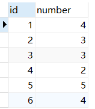
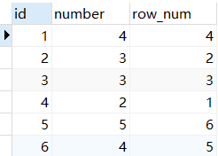
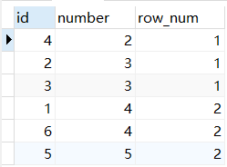
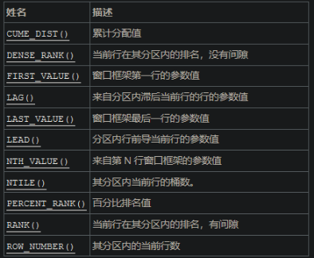

# 1.两数之和

```go
package main

import "fmt"

func main() {
	nums := []int{3, 2, 4}
	target := 6
	index := twoSum(nums, target)
	fmt.Println(index)
}
func twoSum(nums []int, target int) []int {
	var index []int
	var res []int
	hashSet := make(map[int]struct{})
	for k1 := 0; k1 < len(nums); k1++ {
		for k2 := 0; k2 < len(nums); k2++ {
			num1 := nums[k1]
			num2 := nums[k2]
			if num1+num2 == target && k1 != k2 {
				index = append(index, k1)
				index = append(index, k2)
			}
			for _, v := range index {
				hashSet[v] = struct{}{}
			}
		}
	}
	for k, _ := range hashSet {
		res = append(res, k)
	}
	return res
}

```

# 3.无重复字符的最长子串

```go
package main

import (
	"fmt"
)

func main() {
	s := "pwwkew"
	i := lengthOfLongestSubstring(s)
	fmt.Println(i)
}
func lengthOfLongestSubstring(s string) int {
	l, r, max := 0, 0, 0
	m := map[byte]int{}
	for ; r < len(s); r++ {
		v := s[r]
		if _, ok := m[v]; !ok {
			m[v] = r
		} else {
			//更新r，设置l=之前的r+1
			if m[v]+1 >= l {
				l = m[v] + 1
			}
			m[v] = r
		}
		if r-l+1 > max {
			max = r - l + 1
		}
		fmt.Println(m)
	}
	return max
}

/*
l, r, Max := 0, 0, 0
	m := map[byte]int{}
	for ; r < len(s); r++ {
		fmt.Println(m[s[r]])
		fmt.Println(string(s[r]))
		if _, ok := m[s[r]]; !ok {
			m[s[r]] = r
		} else {
			if m[s[r]]+1 >= l {
				l = m[s[r]] + 1
			}
			m[s[r]] = r
		}
		if r-l+1 > Max {
			Max = r - l + 1
		}
	}
	return Max
*/

```


# 5.最长回文子串(待完成)

```go
package main

import "fmt"

func main() {
	s := "babad"
	fmt.Println(longestPalindrome(s))
}
func longestPalindrome(s string) string {
	left, right, max, l, r := 0, 1, 0, 0, 0

	for i := 0; i < len(s); i++ {
		if s[left] == s[right] {
			if left-1 >= 0 {
				left--
				right++
			}
		} else {
			left++
			right++
		}
		if right-left+1 > max {
			max = right - left + 1
			l = left
			r = right + 1
		}
	}
	ss := s[l:r]
	return ss
}

```


# 26.删除有序数组中的重复项

```go
package main

import "fmt"

func main() {
	nums := []int{0, 0, 1, 1, 1, 2, 2, 3, 3, 4}
	l := removeDuplicates(nums)
	fmt.Println(l)
}
func removeDuplicates(nums []int) int {
	if len(nums) == 0 {
		return 0
	}
	left, right := 1, 1
	for right < len(nums) {
		if nums[right] != nums[right-1] {
			nums[left] = nums[right]
			left++
		}
		right++
	}
	return left
}

// 错误：题目要求不要使用额外的空间，必须在原地修改输入数组 并在使用O(1)额外空间的条件下完成
func removeDuplicates(nums []int) int {
	intInSlice := func(i int, list []int) bool {
		for _, v := range list {
			if v == i {
				return true
			}
		}
		return false
	}
	var Uniq []int
	for _, v := range nums {
		if !intInSlice(v, Uniq) {
			Uniq = append(Uniq, v)
		}
	}
	fmt.Println(Uniq)
	return len(Uniq)
}

// 错误：要在原数组基础上删除
func removeDuplicates(nums []int) int {
	hashSet := make(map[int]struct{})
	for _, v := range nums {
		hashSet[v] = struct{}{}
	}
	return len(hashSet)
}

方法一：双指针

这道题目的要求是：对给定的有序数组 nums\textit{nums}nums 删除重复元素，在删除重复元素之后，每个元素只出现一次，并返回新的长度，上述操作必须通过原地修改数组的方法，使用 O(1)O(1)O(1) 的空间复杂度完成。

由于给定的数组 nums\textit{nums}nums 是有序的，因此对于任意 i<ji<ji<j，如果 nums[i]=nums[j]\textit{nums}[i]=\textit{nums}[j]nums[i]=nums[j]，则对任意 i≤k≤ji \le k \le ji≤k≤j，必有 nums[i]=nums[k]=nums[j]\textit{nums}[i]=\textit{nums}[k]=\textit{nums}[j]nums[i]=nums[k]=nums[j]，即相等的元素在数组中的下标一定是连续的。利用数组有序的特点，可以通过双指针的方法删除重复元素。

如果数组 nums\textit{nums}nums 的长度为 000，则数组不包含任何元素，因此返回 000。

当数组 nums\textit{nums}nums 的长度大于 000 时，数组中至少包含一个元素，在删除重复元素之后也至少剩下一个元素，因此 nums[0]\textit{nums}[0]nums[0] 保持原状即可，从下标 111 开始删除重复元素。

定义两个指针 fast\textit{fast}fast 和 slow\textit{slow}slow 分别为快指针和慢指针，快指针表示遍历数组到达的下标位置，慢指针表示下一个不同元素要填入的下标位置，初始时两个指针都指向下标 111。

假设数组 nums\textit{nums}nums 的长度为 nnn。将快指针 fast\textit{fast}fast 依次遍历从 111 到 n−1n-1n−1 的每个位置，对于每个位置，如果 nums[fast]≠nums[fast−1]\textit{nums}[\textit{fast}] \ne \textit{nums}[\textit{fast}-1]nums[fast]​=nums[fast−1]，说明 nums[fast]\textit{nums}[\textit{fast}]nums[fast] 和之前的元素都不同，因此将 nums[fast]\textit{nums}[\textit{fast}]nums[fast] 的值复制到 nums[slow]\textit{nums}[\textit{slow}]nums[slow]，然后将 slow\textit{slow}slow 的值加 111，即指向下一个位置。

遍历结束之后，从 nums[0]\textit{nums}[0]nums[0] 到 nums[slow−1]\textit{nums}[\textit{slow}-1]nums[slow−1] 的每个元素都不相同且包含原数组中的每个不同的元素，因此新的长度即为 slow\textit{slow}slow，返回 slow\textit{slow}slow 即可。

链接：https://leetcode.cn/problems/remove-duplicates-from-sorted-array/solution/shan-chu-pai-xu-shu-zu-zhong-de-zhong-fu-tudo/

func removeDuplicates(nums []int) int {
    n := len(nums)
    if n == 0 {
        return 0
    }
    slow := 1
    for fast := 1; fast < n; fast++ {
        if nums[fast] != nums[fast-1] {
            nums[slow] = nums[fast]
            slow++
        }
    }
    return slow
}

复杂度分析
    时间复杂度：O(n)O(n)O(n)，其中 nnn 是数组的长度。快指针和慢指针最多各移动 nnn 次。
    空间复杂度：O(1)O(1)O(1)。只需要使用常数的额外空间。
```


# 175.组合两个表

```sql
select p.firstName as firstName, p.lastName as lastName,a.city as city, a.state as state from person p left join address a on p.personId = a.personId
-- 注意题目要求地址表中没有 personId = 1 的地址，所以它们的城市和州返回 null。addressId = 1 包含了 personId = 2 的地址信息。
```


# 176.第二高的薪水

```sql
select IFNULL((select distinct salary from Employee order by salary desc limit 1 offset 1),null) as SecondHighestSalary
```


```sql
补充：

1 聚合函数：max聚合，再过滤最大值

select ifnull(
    (select max(salary) 
    from Employee
    where salary < (select max(salary) from Employee)
    ),null
) as SecondHighestSalary;

2.1 排序法：先排序后分页查询

select(
    select distinct salary
    from Employee
    order by salary desc
    limit 1 offset 1
) as SecondHighestSalary; 

2.2 排序：用窗口函数进行排序

select (
    select salary 
    from(
        select distinct(salary), rank() over(order by salary desc) as ranking
        from Employee
    ) as rankTable
    where ranking = 2
) as SecondHighestSalary；

总结：
    ifnull 对查询速度的影响不大，加上可以提高可读性；
    加不加 as 来改名对速度影响不大，但建议加，以提升可读性；
    窗口函数适合的使用场景是“分组排序”，当然也可以不分组来直接解决排序查询任务，但影响了查询效率，代码量也大，不建议。优点是可以直接排序查询，并且很直观；但是缺点是查询速度会慢很多，可能是由于中间添加rank列并生成临时表的操作影响了查询速度。窗口函数的语法如下：

<窗口函数> over (partition by <用于分组的列名>  order by <用于排序的列名>)
```


# 177.第N高的薪水

```sql
CREATE FUNCTION getNthHighestSalary(N INT) RETURNS INT
BEGIN
SET N = N - 1;
  RETURN (
      # Write your MySQL query statement below. 
select IFNULL((select distinct salary from Employee order by salary desc limit 1 offset N),null) as SecondHighestSalary
  );
END
```


# 178.分数排名

```sql
方法1： dense_rank() over(order by 排序字段 desc/asc)：排序函数是相同数值相同序号，且序号是顺序的。 方法2： 排序序号是由大于等于当前分数的，且分数不同的人的个数组成的，所以要先按id（不同的人）分组，再计算不同分数的人的个数，作为排序的序号，展示结果按分数的降序进行。

select score, dense_rank() over(order by score desc) as 'rank' from scores 

性能问题（直接思维）
SELECT score, (SELECT count(DISTINCT score) FROM Scores WHERE score >= s.score) AS 'rank' FROM Scores s ORDER BY Score DESC ;


思路： 1.从两张相同的表scores分别命名为s1，s2。 2.s1中的score与s2中的score比较大小。意思是在输出s1.score的前提下，有多少个s2.score大于等于它。比如当s1.salary=3.65的时候，s2.salary中[4.00,4.00,3.85,3.65,3.65]有5个成绩大于等于他，但是利用count(distinct s2.score)去重可得s1.salary3.65的rank为3 3.group by s1.id 不然的话只会有一条数据 4.最后根据s1.score排序desc

select s1.score,count(distinct s2.score) as rank
from scores as s1,scores as s2
where s1.score<=s2.score
group by s1.id
order by s1.score desc;
```


# 179.最大数

```go
package main

import (
	"fmt"
	"strconv"
)

func main() {
	nums := []int{0, 0, 0}
    // nums := []int{999999998, 999999997, 999999999}
	l := largestNumber(nums)
	fmt.Println(l)
}
func largestNumber(nums []int) string {
	str := ""
	for i := 0; i < len(nums)-1; i++ {
		for j := 0; j < len(nums)-1-i; j++ {
			left := strconv.Itoa(nums[j])
			right := strconv.Itoa(nums[j+1])
			if left+right < right+left {
				nums[j], nums[j+1] = nums[j+1], nums[j]
			}
		}
	}
	for i := 0; i <= len(nums)-1; i++ {
		str += strconv.Itoa(nums[i])
	}
	if str[0] == '0' {
		return "0"
	}
	return str
}

// 补充，特殊情况，字符串由多个0字符拼接而成，且int64最大值为9223372036854775807，最小值为-9223372036854775808
```


# 180.连续出现的数字

```sql
select distinct num as ConsecutiveNums from(
    select num,lag(num) over (order by id) as lag_num,lead(num) over (order by id) as lead_num
    from logs
) as l where l.num=l.lag_num and l.num=l.lead_num
```


```sql
# 1. 三表直接连接
select distinct l1.num as ConsecutiveNums
from Logs as l1, Logs as l2, Logs as l3
where l1.id = l2.id - 1 and l1.id = l3.id - 2 and l1.num = l2.num and l2.num = l3.num

select distinct(l.Num) ConsecutiveNums 
from Logs l 
inner join Logs l2 on l.Num = l2.Num and  l.id = l2.id+1
inner join Logs l3 on l.Num = l3.Num and  l.id = l3.id+2

# 2. 利用having子句过滤

方法一：利用窗口函数求出diff后进行分组，再用having子句过滤
select distinct num as ConsecutiveNums
from (select num, id + 1 - row_number() over(partition by num order by id) as diff
      from Logs) t
group by num, diff
having count(*) >= 3

select distinct num as ConsecutiveNums from 
(select num,id-cast(dense_rank() over (partition by num order by id asc) as signed)  as rn from logs) t1
group by rn,num
having count(*)>=3

方法二：利用表自连接

根据num列相等对logs表进行自连接，根据l1.id进行聚合分组，若分组中满足l1.id与l2.id的差在0到2之间的l2.id大于2个，则说明该num连续出现3次

select distinct l1.num consecutivenums
from logs l1 join logs l2
on l1.num = l2.num
group by l1.id
having sum(l1.id - l2.id between 0 and 2) > 2

根据num列相等，以及id之差的范围在0到2之间，对logs表进行自连接，根据l1.id进行聚合分组，统计分组中l2.id的数目，若大于2即满足题意

select distinct l1.num consecutivenums
from logs l1 join logs l2
on l1.num = l2.num and l1.id - l2.id between 0 and 2
group by l1.id
having count(l2.id) > 2

根据num列相等，以及id之差的范围在0到2之间，对logs表进行自连接，根据l1.id进行聚合分组，统计分组中t1.Num的数目，若大于等于3即满足题意
SELECT distinct(t1.Num) ConsecutiveNums
FROM Logs t1, Logs t2
WHERE
    t1.Num = t2.Num 
    AND
    t2.id BETWEEN t1.id AND t1.id+2
GROUP BY t1.Id
HAVING count(t1.Num) >= 3;

# 3. 窗口函数
select distinct num as ConsecutiveNums
from (select num, (row_number() over(order by id) - row_number() over(partition by num order by id)) as diff
      from Logs) t
group by num, diff
having count(*) >= 3

select distinct num as ConsecutiveNums from
(
    select 
        num, 
        # 从当前记录获取前一行记录的num值，如果没有前一行，则返回null
        lag(num,1,null) over (order by id) as lag_num,
        # 从当前记录获取后一行记录的num值，如果没有后一行，则返回null
        lead(num,1,null) over (order by id) as lead_num
    from logs
) as l
# 当前值等于前一行的值，以及等于后一行的值，即满足了至少出现三次
where l.num = l.lag_num and l.num = l.lead_num

# 4. where子连接
SELECT DISTINCT Num AS ConsecutiveNums FROM Logs 
WHERE (Id+1, Num) IN (SELECT * FROM Logs)
AND (Id+2, Num) IN (SELECT * FROM Logs)

# 5. 利用用户变量实现对连续出现的值进行计数：

select distinct Num as ConsecutiveNums
from (
  select Num, 
    case 
      when @prev = Num then @count := @count + 1
      when (@prev := Num) is not null then @count := 1
    end as CNT
  from Logs, (select @prev := null,@count := null) as t
) as temp
where temp.CNT >= 3

与自关联或自连接相比，这种方法的效率更高，不受Logs表中的Id是否连续的限制，而且可以任意设定某个值连续出现的次数。

针对评论区朋友的疑问，这里做下解答：

1）逻辑：构建两个变量@prev 和@count ，前者用于与Num做比较判断，后者用于@prev和Num相等时的条件计数；

2）(select @prev := null,@count := null) as t 这句的作用是初始化两个变量，并将初始化后的变量放到一张临时表t中，:=符号在MySQL中是赋值的意思；

3）when @prev = Num then @count := @count + 1和when (@prev := Num) is not null then @count := 1 这两个语句不能交换顺序，赋值语句永远非NULL，所以一旦执行顺序来到了第二个when，@count 是一定会被赋值为1的，后者放到前面的话就达不到计数的目的；

4）(@prev := Num) is not null这部分去掉后面加的判断，SQL也能正常执行，上面SQL中case when的这种用法，when后是判断条件，赋值后又加判断，我原以为这样会好理解点；

5）case when本质是一个函数，有值时就返回内部处理得到的值，无值就返回NULL，针对每一个Num，上面SQL中的case when 都会有一个计数，并把这个计数返回给CNT。

PS：MySQL8.0以后的版本开始支持窗口函数，使用窗口函数也能很好的解决此类问题。关于MySQL的窗口函数，可以参考译文：https://blog.csdn.net/qq_41080850/article/details/86416106
```


# 181.超过经理收入的员工

```sql
select e.Name as Employee
from employee e
where salary > (select salary from employee where Id = e.ManagerId)
```


# 182.查找重读的电子邮箱

```sql
select distinct p1.email from person p1 inner join person p2 on p1.id!=p2.id and p1.email=p2.email

having ＋聚合函数 > select Email from Person group by Email having count(Email) > 1;
自链接 > select DISTINCT p1.Email from Person p1, Person p2 where p1.Email = p2.Email and p1.Id != p2.Id;
子表查询 > select Email from (select count(1) as t, Email from Person group by Email) r where r.t > 1;
```


# 183.从不订购的客户

```sql
# 左连接
select c.Name as Customers from Customers c left join Orders o on o.CustomerId = c.Id where o.Id is null;

# not exists
select c.Name as Customers from Customers c where not exists (select 1 from Orders o where o.CustomerId = c.Id);

# not in
select c.Name as Customers from Customers c where c.Id not in (select distinct o.CustomerId from Orders o);
```


# 184.部门工资最高的员工

```sql
# 1.开窗函数
select t.department ,t.employee,t.salary
from (
select d.name Department ,e.name employee,e.salary,dense_rank() over (partition by e.departmentId order by e.salary desc)  rn
from department d, employee e
where d.id=e.departmentId
) as t
where t.rn=1

# 2.max()最大值
select 
    d.Name as Department,
    e.Name as Employee,
    e.Salary 
from 
    Employee e,Department d 
where
    e.DepartmentId=d.id 
    and
    (e.Salary,e.DepartmentId) in (select max(Salary),DepartmentId from Employee group by DepartmentId);
```


# 185.部门工资前三高的所有员工

```sql
# 1.开窗函数
select t.department ,t.employee,t.salary
from (
select d.name Department ,e.name employee,e.salary,dense_rank() over (partition by e.departmentId order by e.salary desc)  rn
from department d, employee e
where d.id=e.departmentId ) as t
where t.rn<4

# 1.having count()
可以先group by然后用having count()来筛选，找每个部门的工资前三名，那么先在子查询中用Employee和自己做连接，连接条件是【部门相同但是工资比我高】，那么接下来按照having count(Salary) <= 2来筛选的原理是：如果【跟我一个部门而且工资比我高的人数】不超过2个，那么我一定是部门工资前三，这样内层查询可以查询出所有符合要求的员工ID，接下来外层查询就简单了。

select d.Name as Department,e.Name as Employee,e.Salary as Salary
from Employee as e left join Department as d 
on e.DepartmentId = d.Id
where e.Id in
(
    select e1.Id
    from Employee as e1 left join Employee as e2
    on e1.DepartmentId = e2.DepartmentId and e1.Salary < e2.Salary
    group by e1.Id
    having count(distinct e2.Salary) <= 2
)
and e.DepartmentId in (select Id from Department)
order by d.Id asc,e.Salary desc
```


# 187.重复的DNA序列(待完成)

```sql
package main

import "fmt"

func main() {
	// nums := []int{0, 0, 1, 1, 1, 2, 2, 3, 3, 4}
	nums := "AAAAAAAAAAAAA"

	l := findRepeatedDnaSequences(nums)
	fmt.Println(l)
}
func findRepeatedDnaSequences(s string) []string {
	arrStr := make([]string, 0)
	for i := 0; i+10 < len(s); i++ {
		str := s[i : i+10]
		for j := i; j+10 < len(s); j++ {
			if i != j {
				innerStr := s[j : j+10]
				if str == innerStr {
					arrStr = append(arrStr, str)
					break
				}
			}
		}
	}
	if len(arrStr) > 1 {
		if arrStr[0] == arrStr[1] {
			arrStr = append(arrStr[:1], arrStr[2:]...)
		}
	}
	return arrStr
}


错误：测试，"AAAAAAAAAAA"；输出，[]；预期结果，["AAAAAAAAAA"]
```


# 196.删除重复电子邮箱

```sql
delete from person where id not in (
    select t.id from (select min(id)as id from person group by email)t
    )

-- 错误：You can't specify target table 'person' for update in FROM clause
delete from person where id not in (
    select min(id)as id from person group by email
    )
-- 查询优化器对第一个查询执行派生合并优化（这会导致它因错误而失败），但第二个查询不符合派生合并优化的条件。因此，优化器被迫首先执行子查询。

https://stackoverflow.com/questions/45494/mysql-error-1093-cant-specify-target-table-for-update-in-from-clause
```


# 197.上升的温度

```sql
select w1.id from weather w1 inner join weather w2 on w1.temperature>w2.temperature and w1.recordDate=DATE_ADD(w2.recordDate,INTERVAL 1 DAY)

-- 方法一：我们可以使用MySQL的函数Datadiff来计算两个日期的差值，我们的限制条件是温度高且日期差1，参见代码如下：
select w1.Id from weather w1
inner join weather w2 on w1.Temperature > w2.Temperature and DATEDIFF(w1.RecordDate, w2.RecordDate) = 1;

-- 方法二：下面这种解法我们使用了MySQL的TO_DAYS函数，用来将日期换算成天数，其余跟上面相同：
SELECT w1.Id FROM Weather w1, Weather w2
WHERE w1.Temperature > w2.Temperature AND TO_DAYS(w1.RecordDate)=TO_DAYS(w2.RecordDate) + 1;

-- 方法三：我们也可以使用Subdate函数，来实现日期减1，参见代码如下：
SELECT w1.Id FROM Weather w1, Weather w2
WHERE w1.Temperature > w2.Temperature AND SUBDATE(w1.RecordDate, 1) = w2.RecordDate;
```


# 数据库补充


## IFNULL

```sql
IFNULL() 函数用于判断第一个表达式是否为 NULL，如果为 NULL 则返回第二个参数的值，如果不为 NULL 则返回第一个参数的值。
IFNULL() 函数语法格式为：
IFNULL(expression, alt_value)
如果第一个参数的表达式 expression 为 NULL，则返回第二个参数的备用值。

参数说明:
参数 描述
expression 必须，要测试的值
alt_value 必须，expression 表达式为 NULL 时返回的值

实例
第一个参数为 NULL：
SELECT IFNULL(NULL, “RUNOOB”);
以上实例输出结果为：
RUNOOB

第一个参数不为 NULL：
SELECT IFNULL(“Hello”, “RUNOOB”);
以上实例输出结果为：
Hello

原文链接：https://blog.csdn.net/yajie_12/article/details/102583061
```


## DISTINCT

```sql
distinct用来查询不重复记录的条数,即用distinct来返回不重复字段的条数（count(distinct id)）,其原因是distinct只能返回他的目标字段，而无法返回其他字段。

注意事项
distinct 【查询字段】，必须放在要查询字段的开头，即放在第一个参数；
只能在SELECT 语句中使用，不能在 INSERT, DELETE, UPDATE 中使用；
DISTINCT 表示对后面的所有参数的拼接取不重复的记录，即查出的参数拼接每行记录都是唯一的。不能与all同时使用，默认情况下，查询时返回的就是所有的结果。

使用实例
只对一个字段查重：表示选取该字段一列不重复的数据。
多个字段去重：表示选取多个字段拼接的一条记录，不重复的所有记录。改进：使用 group_concat 函数；使用group by函数。
聚合函数中使用distinct：一般跟 COUNT 结合使用, count()会过滤掉null项，即null项不进行计数。


原文链接：https://blog.csdn.net/shenziheng1/article/details/102536146
```

## 四大排名函数

**一、ROW_NUMBER()**
Row_number() 在排名是序号 连续 不重复，即使遇到表中的两个一样的数值亦是如此

```sql
select *,row_number() OVER(order by number ) as row_num from num 
```


数据如下：



结果如图：


注意：在使用row_number() 实现分页时需要特别注意一点，over子句中的order by 要与SQL排序记录中的order by保持一致，否则得到的序号可能不是连续的
select *,row_number() OVER(order by number ) as row_num from num ORDER BY id



**二、rank()**
Rank() 函数会把要求排序的值相同的归为一组且每组序号一样，排序不会连续执行

select *,rank() OVER(order by number ) as row_num from num 

结果如下：


**三、dense_rank()**
Dense_rank() 排序是连续的，也会把相同的值分为一组且每组排序号一样

select *,dense_rank() OVER(order by number ) as row_num from num 

结果如下：


**四、ntile()**
Ntile(group_num) 将所有记录分成group_num个组，每组序号一样

select *,ntile(2) OVER(order by number ) as row_num from num 




```sql
一、ROW_NUMBER()
Row_number() 在排名是序号，连续，不重复，即使遇到表中的两个一样的数值亦是如此。
注意：在使用row_number() 实现分页时需要特别注意一点，over子句中的order by 要与SQL排序记录中的order by保持一致，否则得到的序号可能不是连续的。
二、rank()
Rank() 函数会把要求排序的值相同的归为一组且每组序号一样，排序不会连续执行。
三、dense_rank()
Dense_rank() 排序是连续的，也会把相同的值分为一组且每组排序号一样。
四、ntile()
Ntile(group_num) 将所有记录分成group_num个组，每组序号一样。
```

## 窗口函数

